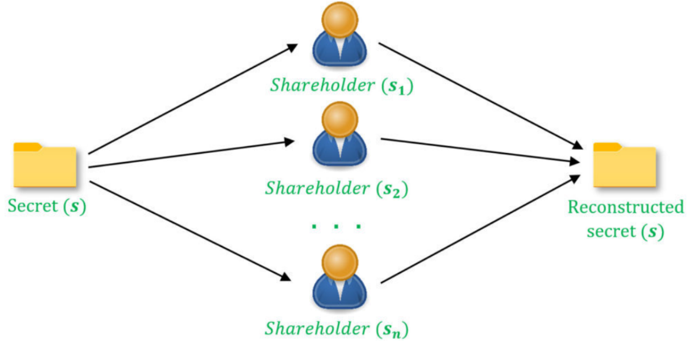

# Message Authentication Code

Let's now learn about Message Authentication Code (MAC).

A Message Authentication Code is a hidden code snippet in online communication. In SSL/TLS connections, the MAC "tag" provides assurance that the received message is from a genuine user and helps prove the guarantee that the message has not been altered during the transmission process.

In computer systems, data is in binary, meaning computers use bits (1s and 0s) for communication. Data is often processed in the form of blocks or single-bit streams (blocks = a group of 1s and 0s, stream = 1 or 0). However, how do we know if the message received through an online data stream is sent by a genuine user and hasn't been altered during transmission?

We need a method to verify if the message comes from the genuine sender (not an imposter) and whether the data has been modified (i.e., it arrives as expected). This is where Message Authentication Code comes into play. But what is a Message Authentication Code, and what role does it play in internet security?

What is a Message Authentication Code (MAC)? A Message Authentication Code (MAC) is a code used to inform who created or sent the received message and whether the data has been altered. It accomplishes this by using a shared key (i.e., a private key) known only to the sender and receiver to authenticate the legitimacy of the sender on the internet.

MAC is sometimes referred to as a "tag" because it is a shorter piece of authentication data attached to the message. It is also sometimes called a "keyed hash function" because it uses a symmetric key shared between the message sender and receiver.

Message Authentication Code provides two key attributes:

1. **Integrity:** The sender can attach this secret code to any message and enable the intended recipient to verify it.
2. **Non-repudiation (Security):** MAC provides security by preventing malicious parties intercepting messages from forging the tag in the future when attempting to send fraudulent messages. It achieves this by preventing them from forging tags for previously untagged new messages.

MAC algorithms authenticate the identity of legitimate senders, ensuring that the data indeed comes from them. It does not protect the confidentiality of the data.

In other words, essentially, MAC helps the recipient to check:

1. Whether the message comes from a legitimate sender (because they have a shared secret key).
2. Whether the message has been altered in some way after being sent (whether accidentally or intentionally) (because MAC uses hashing to verify the integrity of the data).

Why is this important? Because the internet is inherently insecure; it is an open network that transmits data in plain text, meaning anyone with the knowledge can intercept the data. This means that without proper security mechanisms, someone could intercept incoming messages in transit and replace them with false content. Or, if they are the sender, they could send entirely new messages and make them look like they were sent by someone else.

Without a mechanism to check whether one is communicating with the right person and whether the data has not been altered, received information cannot be trusted.

MAC provides authentication and data integrity checks (but does not support non-repudiation).

In a sense, a Message Authentication Code is somewhat like a symmetric key version of a digital signature. (Digital signatures are exclusively used in asymmetric encryption systems.) When using MAC, the sender and receiver employ a single key, whereas in digital signatures, a public-private (asymmetric) key pair is used. The sender signs their message with one key, and the receiver accesses the message with another key.

However, there is a significant distinction between MAC and digital signatures, which can be summarized in two words: non-repudiation.

* Digital signatures ensure that the sender cannot deny sending the message because only one party possesses the private key.
* MAC does not provide this additional layer of security since the symmetric key it uses is known to multiple parties. As both the sender and receiver can access the key, it is impossible to verify who is responsible for creating the message.

Due to MAC offering authentication and data integrity protection, they are valuable for helping user devices determine whether to accept or reject a message. If the MAC is invalid, their devices will not return plaintext but instead display an error message.

MACs are typically embedded in message headers and/or encryption keys. They are often appended to ciphertext as a means to enable authenticated encryption. Thus, they are used to verify the legitimacy and integrity of data transmitted over internal or external networks, including SSH and SSL/TLS connections (to prevent malicious packets from being inserted into the connection), stored within an organization's internal systems, or stored in external systems or devices.

MACs are created by combining a symmetric (secret) key with the message and then hashing it using a hash function. Yes, Message Authentication Codes generate a result output (MAC) by combining the arbitrary length of the message and the specific combination of the secret key:

Input = Message + Secret Key Output = Hashed Message Authentication Code Digest

When breaking down a Message Authentication Code, it looks like this:

h(k, m) — or considered another way as hash(key, message)

Essentially, the secret key is combined with the message, hashed, and transformed into a fixed-length string of hexadecimal characters to obfuscate the message's size.

<figure><figcaption></figcaption></figure>

The diagram above illustrates the creation process of a Message Authentication Code (MAC).

Hashing and MAC are related but distinct concepts.

Hash (Hashing) and Message Authentication Code (MAC) are two cryptographic techniques used to ensure data integrity and security, with some key differences:

1. Purpose:
   * Hash: Primarily used to generate a fixed-length digest of data, typically irreversible. Hash functions find wide applications in data structures, cryptography, digital signatures, etc. Common hash algorithms include MD5, SHA-256, etc.
   * MAC: Used to simultaneously verify the integrity of a message and authenticate the sender of the message. MAC combines hash functions and a key, providing verification of both data integrity and sender identity.
2. Algorithm Structure:
   * Hash: One-way irreversible; the same input always produces the same hash value, but different inputs may produce the same hash value (hash collision).
   * MAC: Uses a key to generate an authentication tag for the message; the key ensures that only those who know the key can verify or generate the correct MAC.
3. Key Usage:
   * Hash: Does not involve keys; it is a public algorithm that can be used anywhere.
   * MAC: Involves a key; the sender and receiver must share the key. Only parties with the shared key can verify and generate the MAC.
4. Security:
   * Hash: Mainly used for data integrity but lacks an authentication mechanism. As hashes are public, anyone can generate the same hash value.
   * MAC: Provides not only integrity protection but also sender identity verification, as only those who know the key can generate the correct MAC.
5. Application Areas:
   * Hash: Used for data integrity verification, cryptography, digital signatures, etc. Common applications include file checksums, password storage, etc.
   * MAC: Used for identity authentication and data integrity verification in network communications. Protocols such as TLS/SSL, SSH use MAC to ensure the security of communication.

In general, hashing and MAC serve different objectives and application scenarios in cryptography, and the choice between them depends on specific security requirements and use cases.

A Message Authentication Code is a code sequence that enables the verification of whether a message comes from a legitimate user or device. It is created by combining an encrypted symmetric key with the plaintext message, and then hashing the result through a process called a hash function to produce a unique set of data.

Consider a scenario where you are communicating with a friend who owes you money. They request your bank account and routing numbers to facilitate repayment. You send the information to them, they use it for the transfer, and everyone is happy.

However, what if an attacker intercepts the message and sees an opportunity to make some easy money? They could replace the provided bank account information with details from an account they control. In such a case, without a Message Authentication Code:

* Legitimate bank information is sent to the friend.
* The friend receives the attacker's account information.
* Neither you nor your friend are aware that the information exchange has occurred - the friend sends money to what they believe is your account and never receives the funds.

As imagined, this would lead to an awkward situation where both parties think the other is lying. The reality is that neither of them realizes they haven't engaged in a legitimate communication. This is where a Message Authentication Code plays a crucial role.

When creating a Message Authentication Code (MAC), a key is combined with the message to be protected. Subsequently, this information is hashed into a fixed-length, creating a data string as the MAC. Once done, the message is sent and transmitted to the recipient. Their client then uses the same function to compute the MAC.

If the generated digest matches the provided one, it informs the recipient that the data/message:

1. Is genuine (i.e., sent by a legitimate sender).
2. Has not been tampered with in any way (i.e., the integrity of the message is assured).

<figure><figcaption></figcaption></figure>

The diagram above illustrates the basic process of computing a Message Authentication Code (MAC) to ensure value matching and data integrity.

Certainly, to make this process effective, the key used needs to be safeguarded. This may involve storing the key in a key vault or a Hardware Security Module (HSM). While it is desirable for the intended recipient to know the key, precautions must be taken to ensure that no one else accidentally acquires it. If they do, the key becomes useless and should be promptly invalidated.

Merely having all the correct elements doesn't mean one can create the correct MAC. When combining the secret key and the input message to be protected, both the sender and the communicating party must perform this operation in a specific manner to generate the same Message Authentication Code. Otherwise, if the key and message are combined in one way, and the recipient performs it in a different way, they will obtain entirely different values.

In short, precision and sequence matter. This can be likened to the process of baking cookies (I mean real cookies, not tracking data bits of internet users).

For instance, when baking chocolate chip cookies, it's usually desired to cream softened butter and sugar together before gradually introducing other wet ingredients (eggs and vanilla) and gradually adding dry ingredients (flour, baking powder, etc.). If one simply pours in the dry ingredients and then attempts to add butter, sugar, eggs, etc., afterward, they will end up with a dough of a very different (typically unpleasant) consistency.

This concept applies similarly to message integrity. As one can imagine, having a mismatched hash value when the recipient attempts to verify the data's integrity is not favorable.

In cryptography, there is a special relationship between hash and MAC. They are both cryptographic functions, and while one involves the other, this relationship is somewhat one-way. Hash does not use MAC, but MAC uses hash as part of its process:

Hash combines a cryptographic hash function with a message, creating a fixed-length random data string (i.e., hash output or digest) without authentication. Hash, by itself, does not provide assurance of the sender's identity because there is no shared secret key. It is used solely to verify the integrity of message data, not the sender's identity.

A Message Authentication Code uses a single key combined with a message and hashes it to verify the sender's identity and ensure data integrity. Incorrectly combining these two components will result in generating a different MAC. This provides assurance that the sender is who they claim to be, but it does not guarantee that the message has not been compromised or altered since being sent. Unlike using hash alone, this requires the secret key combined with the message before hashing.

However, it is important to note that if not implemented correctly, MACs are not one hundred percent reliable, and some may be vulnerable to padding oracle attacks. These attacks involve malicious actors exploiting padding verification in encrypted messages to decrypt their ciphertext. Essentially, by using insecure hash algorithms (MD5, SHA-1, etc.), there is a potential for attackers to alter messages even without knowing the secret key, a scenario known as a length extension attack. This involves the attacker computing hash(m1) using the length of the message.

To avoid this issue, many organizations choose to use a specific type of MAC known as HMAC, rather than applying their MACs in a specific way. But first, let's quickly understand some risks one might face when not using authenticated symmetric encryption security mechanisms.

## CPA

